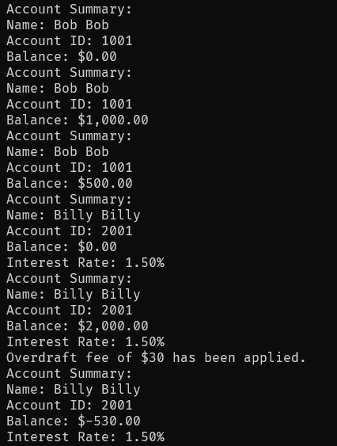

# Banking App
A simple banking app made in Java.

## Overview
This Java program illustrates a banking model and showcases the usage of inheritance to create different types of bank accounts. In this case, the code in this repository has provided one type of banking account, which is a checking account, via its inheritance of the main BankAccount class.

## Usage
1. Ensure you are in the correct directory of the source code.
2. Run ```javac Banking.java``` to compile the code.
3. Run ```java BankingApp``` to start the program.
4. It will display the information provided in the code.

# Example


## Note
There is no input needed for this program as it simply made to showcase a presentation of a banking. 