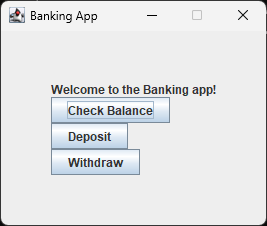

# Banking GUI
A simple banking gui app made in Java.

## Overview
This Java program illustrates the use of a built-in UI library via a simple banking app. It features three main functions: checking balance, depositing, and withdrawing, each utilizing different components such as JFrame, JPanel, JButton, JLabel, and dialogs via JOptionPane.

## Usage
1. Ensure you are in the correct directory of the sub-project.
2. Run ```javac src/*.java -d bin``` to compile the code.
3. Run ```java -cp bin App``` to start the program.
4. It will display a GUI. Enjoy interacting with the app.

# Example


## Note
The GUI is fixed at 300 by 300 thus it may be a bit smaller on a 4k display and a bit larger on resolution less than 1080p.