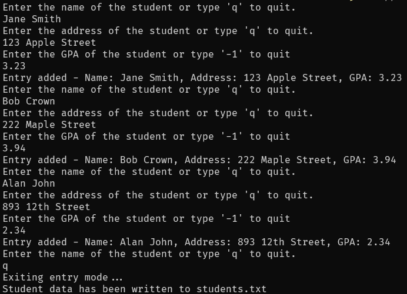
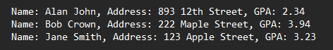

# Grade Writer
A simple Java program for relating to grades and students.

## Overview
This project serves as the final project for CSC372. It utilizes various lessons taught in the course, covering inputs, outputs, error handling, data sorting, and comparators.  The project utilize students as the model to reflect these lessons through code. Users are prompted to enter information such as a student's name, address, and GPA. The collected data is then output to a file in an organized manner, sorted by ascending names.

## Usage
1. Ensure you are in the correct directory of the sub-project.
2. Run ```javac src/*.java -d bin``` to compile the code.
3. Run ```java -cp bin App``` to start the program.
4. Enjoy the simplicity of this program.

## Example
Running program <br>

Program output <br>


## Note
The program will not exit properly if force quit. The program will warn if no entries were made upon exiting; however, it will still write to the output file.