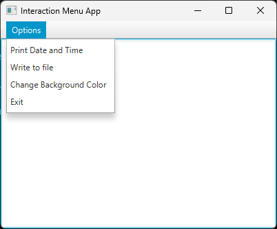

# Interaction Menu
A simple ui app made in java.

## Overview
The goal of this project is to illustrate the usage of JavaFX Application, alongside its other features such as menus, which this project aims to demonstrate. The application provides four different options to interact with. One option is to print the current time and date onto the app. The second option allows for the output of the date and time to be stored in a file called log.txt. The third option enables the user to change the background color to a random color. The last option allows the user another way of exiting the app.

## Usage
1. Ensure you are in the correct directory of the sub-project.
2. Run ```javac src/App.java -d bin``` to compile the code.
3. Enter directory of the build via ```cd bin```.
4. Run ```java App``` to start the program.
5. Enjoy interacting with the app.

## Example


## Note
It is to be noted the log.txt file is generated relative to the execution of the app.