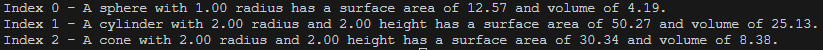

# Module 4
A simple Java program about shapes.

## Overview
This project aims to illustrate object-oriented principles, including inheritance, polymorphism, and encapsulation in Java. It provides a flexible and reusable framework for handling geometric shapes. In this case, the Shape class serves as a base class for all shapes, which is extended by the Sphere, Cylinder, and Cone classes. The ShapeArray class serves as a means to host these objects and provides functionality to print out information related to each object.

## Usage
1. Ensure you are in the correct directory of the sub-project.
2. Run ```javac src/*.java -d bin``` to compile the code.
3. Run ```java -cp bin App``` to start the program.
4. Enjoy the simplicity of this program.

## Example
Program execution <br>


UML Diagram <br>


## Note
There are no inputs required in this program. Its primary purpose is solely to demonstrate the project.
