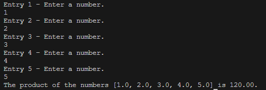

# Module 5
A simple Java program about recursion.

## Overview
This project serves as a demonstration of simple recursion in Java. It achieves this by prompting the user to input five numbers. These numbers are then recursively multiplied until reaching the final number, after which the result is presented to the user. Through this process, the program showcases the fundamental concept of recursion, illustrating how a function can call itself to solve a problem.

## Usage
1. Ensure you are in the correct directory of the sub-project.
2. Run ```javac src/*.java -d bin``` to compile the code.
3. Run ```java -cp bin App``` to start the program.
4. Enjoy the simplicity of this program.

## Example


## Note
There are no inputs required in this program. Its primary purpose is solely to demonstrate the project.
