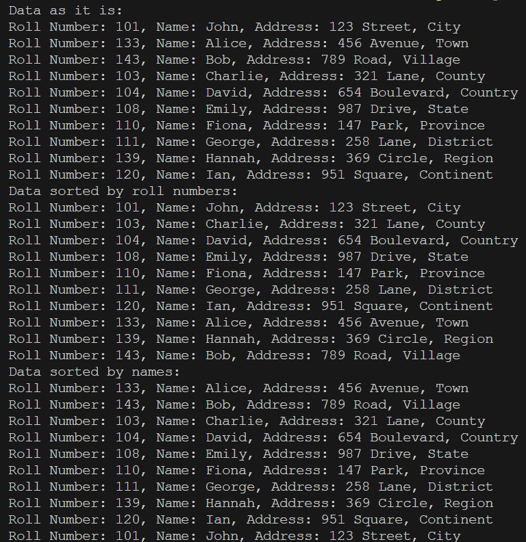

# Students
A simple Java program modeling students.

## Overview
This project serves as a demonstration of comparators and selection sort in Java using students as the data model. This is accomplished via four distinct classes: one for representing the student model and another to represent a list of students. The other two classes implement and represent their respective comparators that are utilized in the selection sort when sorting by names or roll numbers.

## Usage
1. Ensure you are in the correct directory of the sub-project.
2. Run ```javac src/*.java -d bin``` to compile the code.
3. Run ```java -cp bin App``` to start the program.
4. Enjoy the simplicity of this program.

## Example


## Note
There are no inputs required in this program. Its primary purpose is solely to demonstrate the project.